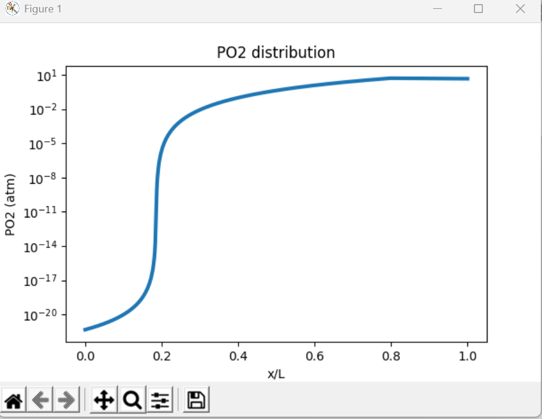
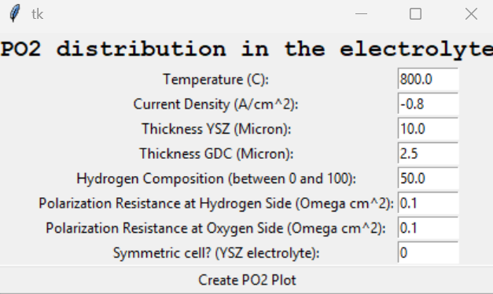

# PO2distribution in electrolyte in SOEC

Contributor: Qian Zhang (Northwestern University)

             qian.zhang_jennifer@northwestern.edu
             
This is a program with GUI to generate PO2 distribution in the electrolyte for two-layer full cells and symmetric cells with YSZ as electrolyte in hydrogen enviroment or air enviroment.

To use the code, you just run main.py with Python 3.+ and fill in the experimental data in the corresponding position as labels in the GUI as shown below. 

Parameters: Almost all the parameters in the GUI are with the names as it is.

Symmetric cell?: 

0.0 : full cell, YSZ-GDC two-layer electrolyte

1.0 : symmetric cell in hydrogen, YSZ electrolyte
                 
2.0 : symmetric cell in air, YSZ electrolyte

The algorithm of calculating the distribution of PO2 in this app is published:
https://www.sciencedirect.com/science/article/abs/pii/S1359645421003086

If you find the code is helpful, please cite this paper.
